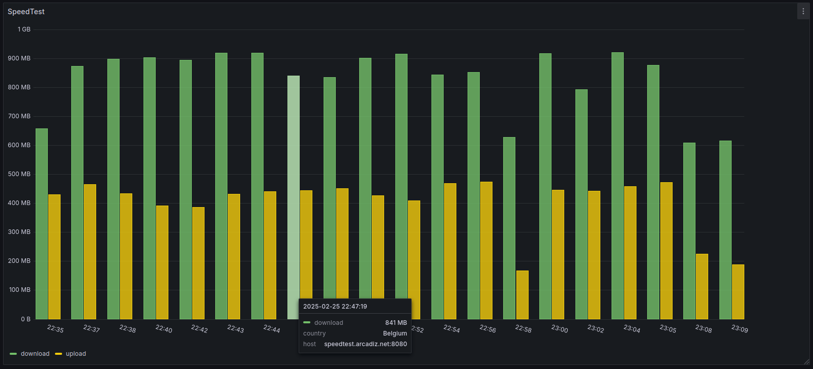

# Speedtest-cli with OpenTelemetry

To fight the unwinable battle of bad internet connections, this service runs a speedtest-cli every few minutes and sends the results to an OpenTelemetry collector. This allows for monitoring of the internet connection over time. I'm attaching a Grafana dashboard that can be used to visualize the data.



## Installation and configuration

Get prebuilt docker image from dockerhub:
```
docker run -i -e OTEL_EXPORTER_OTLP_ENDPOINT='http://192.168.0.2:4137/v1/logs' --name speedtest slickdomi/speedtest-cli-otel:latest
```

Configure the service using the following environment variables:

By default the service will run a speedtest every 25-35 minutes (1500-2100 seconds) and send the results to the OpenTelemetry collector.
```
every_seconds_from 1500
every_seconds_to 2100
```

```
service_name speedtest
instance_id 1
OTEL_EXPORTER_OTLP_ENDPOINT http://192.168.0.2:4137/v1/logs
```

For other OTEL env variables refer to https://opentelemetry.io/docs/languages/sdk-configuration/otlp-exporter/

Docker container available at https://hub.docker.com/r/slickdomi/speedtest-cli-otel
